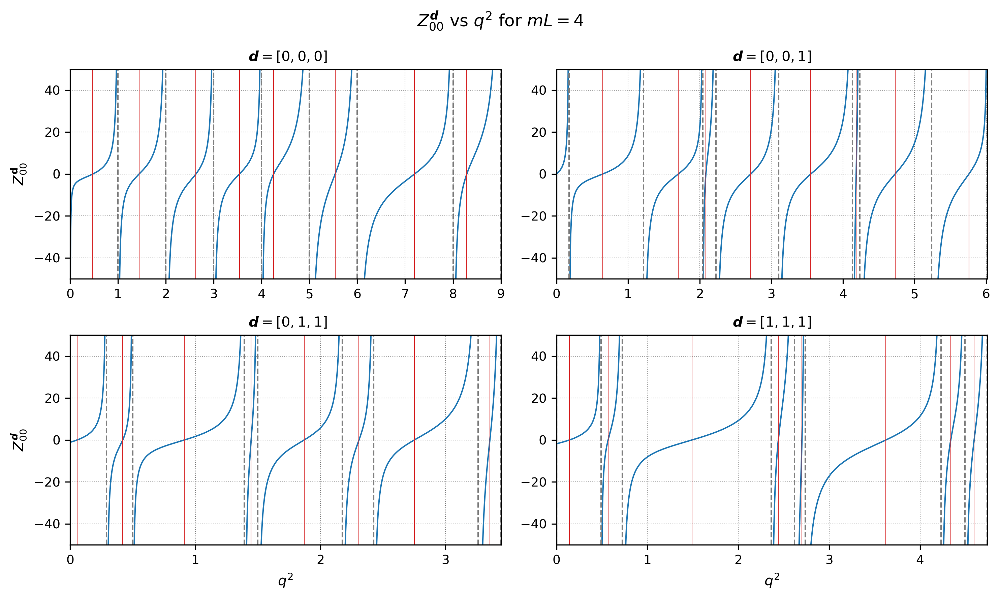

# The Zeta Function and Lattice QCD

<!--ts-->
* [The Zeta Function and Lattice QCD](#the-zeta-function-and-lattice-qcd)
   * [Introduction and Overview](#introduction-and-overview)
   * [Why QCD is difficult](#why-qcd-is-difficult)
   * [The Magic of the Quantisation Codition](#the-magic-of-the-quantisation-codition)
   * [What is Zeta?](#what-is-zeta)
   * [The Unitary Points](#the-unitary-points)
   * [Appendix: Some more equations](#appendix-some-more-equations)

<!-- Created by https://github.com/ekalinin/github-markdown-toc -->
<!-- Added by: ericrechberger, at: Fri Mar 29 08:50:24 GMT 2024 -->

<!--te-->

## Introduction and Overview

Quantum Chromodynamics is the theory of the strong nuclear force, which is governing interactions of particles in the atomic nucleus and is one of the four fundamental forces of nature. Since nuclear particles are very small and light [citation needed] a suitable theory of their interaction must incorporate both Einstein’s theory of special relativity (they move really fast) and quantum mechanics (they are really small).  (QFT stuff), which is the wider framework in which QCD is formulated

In practice, any successful scientific theory must make predictions, which in the case of QCD are tested in particle accelerators like CERN in Geneva, Switzerland. The quantity checked in experiments at particle accelerators are generally probabilities of certain events occurring, for example the probability that two particles (say protons) scatter off each other, ie. that they collide and then spread out. This probability is known as the "cross section" of the event,  and it is usually obtained from something called the scattering amplitude. The predicitions of quantum field theories are these amplitudes, which can then be tested at the particle accelerators. 

## Why QCD is difficult

However, obtaining these amplitudes in QCD is much more challenging than in comparable other quantum field theories, such as the theory of the electric force. The standard approach for predicting the amplitudes is approximating complicated interactions with a simple interaction and then adding adding tiny disturbances bit by bit

There is a large number of of processes for which approximate solutions to the complicated equations of QCD do not work. Lattice QCD is a new method emerged which emerged in the last decades which provides solutions even to those cases. 

In lattice QCD, the integrals of QCD are numerically approximated in a toy model of the universe: Space (and time) is treated as if it sat on a finite grid of points. Since in this universe space can only take certain values (the vertices of this grid), the process is called discretisation. This is done, of course, to make the calculations much easier, instead of having to consider every single point in a huge universe, only a tiny grid of points has to be considered. The result of these simulations will still be useful, since if we make this grid larger and larger and the spacing between the grid points smaller we will eventually get back our own universe!

After simulating the equation of lattice QCD on this grid using a lot of computing power, the result obtained is usually some energy associated with the process that was simulated. However, as outlined before, to experimentally test the result in a particle accelerator we need the scattering amplitude. We need a way to convert the energy from the lattice QCD calculation into the probability of the process occurring, otherwise we cannot use lattice QCD.

## The Magic of the Quantisation Codition

The Lüscher Quantisation Codition, named after its discoverer Martin Lüscher, is the equation which fulfills this job. If you tell the equation the energy you obtained from the lattice computations, how big your lattice was, the mass of the particles you simulated and the total momentum of all your particles, it gives you the desired scattering amplitude. Although it is a matrix equation, a good approximation (in which we assume that the angular momentum is 0) for two identical particles of mass $m$ is:

$$q \cot \delta  = \frac{1}{\gamma(q^2,\vec d, mL)}\frac{1}{\pi^{\frac{3}{2}}} Z^{\vec d} (q^2, mL)$$

Before we get into the details of the Zeta function $Z$, it is good to see that this equation asks for the same inputs outlined in the previous paragraph: $q$ is some varible related to the energy from the lattice calculation, $L$ is the size of the lattice, $m$ is the mass of the particle and $\vec d$ is the total momentum of the system. The output that we want is given by $\delta$, it is called the phase shift and can be converted to a acttering probability and thus a cross section, which is what we need for the experiment. The variable $\gamma$ is something known as the Lorentz factor which becomes large if $\vec d$ is big (and is 1 otherwise).

## What is Zeta?

$ Z^{\vec{d}} (q^2, mL)$ in the equation above is known as the Lüscher Zeta function. It is a generalised form of the trigonometric tangent function and is interesting in its own right, but it is hugely important in QCD. 

Qualitatively, if the magnitude of this function is very big then the two particles in the system are only weakly interacting; if it is small the two particles are losely speaking binding to each other, they are interacting very strongly. In my Master's project I investigated the point of maximum interaction, where Zeta is 0, which is also known as the unitary point. The Zeta function can be written as:

$$
 Z^{\vec{d}}(q^2, mL) = \frac{1}{\sqrt{4\pi}}
\, \lim_{\alpha \to 0^+} \,  \left ( \sum_{\vec{r} \in \mathbb Z ^3}  - \; \mathcal{P}  \int {d}^3 \vec{r} \right ) \frac{e^{-\alpha \left( \Gamma^2(\vec r \vert q^2, \vec d, mL) - x \right)}}{\Gamma^2(\vec r \vert q^2, \vec d, mL) - x} \;,
$$

This function is quite complitcated, describing what each varible does, though interesting, would distract from the main point. I have included an explaination of the entire equation at the end of the document. These are the key aspects of this equation:

1) We are summing over a variable called $\vec r$ which represents a vector from some origin to each vertex in a grid. We assume this grid to go on forever, although related to the spatial grid from the computation it is different.
2) The function $\Gamma^2$ distorts this grid if the total momentum $\vec d$ is not equal to zero. If zero, we just get our original grid back.
3) The variable $\alpha$ and the integral need to be in the above expression since otherwise the function would never settle at a single value. 

The function takes a beatiful form when we graph Zeta vs. the $q^2$.

In this image, we picked four different values for the total momentum $\vec d$. For $\vec d = 0$ we have the unshifted, original function and it takes a very simple form. For other values of $\vec d$ we see that the asymptotes (where the function shoots off the image) that represent the non-interacting points are shifted quite chaotically. This comes from the fact that the lattice itself is shifted in these cases. 
On the graph, the dashed, black lines mark the asymptotes of the function and the red lines where the function equals zero, i.e. the unitary points. 

## The Unitary Points

Although it is relatively simple to find the asymptotes of Zeta, the zeros of the function have to be found 

For $\vec{d} = [0,0,0]$
<audio controls>
  <source src='PublicSummary/d000.mp3'type="audio/mpeg">
  Your browser does not support the audio element.
</audio>

For $\vec{d} = [0,0,1]$
<audio controls>
  <source src='PublicSummary/d001.mp3'type="audio/mpeg">
  Your browser does not support the audio element.
</audio>

For $\vec{d} = [0,1,1]$
<audio controls>
  <source src='PublicSummary/d011.mp3'type="audio/mpeg">
  Your browser does not support the audio element.
</audio>

For $\vec{d} = [1,1,1]$
<audio controls>
  <source src='PublicSummary/d111.mp3'type="audio/mpeg">
  Your browser does not support the audio element.
</audio>

## Appendix: Some more equations

For the curious, this section includes all as of yet undefined parts of the equations from the main text. Note that the fundamental constants $\hbar = c = 1$; this is the natural and common choice for the small, energetic particles of QCD! 

The variable $q$, which has the dimensions of momentum, can be found from the Energy outputs from the lattice calculations using:

$$
E = \sqrt{4\left( \frac{2\pi}{L} q\right)^2 +   \left( \frac{2\pi}{L} \vert \vec d \vert\right)^2 + 4m^2}
$$

The lorentz factor is given by:
$$
\gamma(q^2, \vec d, mL) =  \sqrt{1 +  \frac{\vert\vec d\vert^2}{4q^{2}+\left(\frac{mL}{\pi}\right)^2}}
$$

And finally:
$$
\Gamma^2(\vec r \vert q^2, \vec d, mL)\equiv \frac{1}{\gamma(q, \vec d, mL)^2}\left(\! \frac{\vec r \cdot \vec d}{\vert \vec d \vert}  + \frac{\vert \vec d \vert}{2}\right)^2 + \bigg( \vec r - \frac{\vec r \cdot \vec d}{  \vert \vec d \vert^2} \, \vec d \bigg  ) \,,
$$

This tranform reduces to $\vert \vec r \vert^2$ if $\vec d = 0$. 

The Zeta function, repeating the function from the main section, is defined as:

$$
 Z^{\vec{d}}(q^2, mL) = \frac{1}{\sqrt{4\pi}}
\, \lim_{\alpha \to 0^+} \,  \left ( \sum_{\vec{r} \in \mathbb Z ^3}  - \; \mathcal{P}  \int {d}^3 \vec{r} \right ) \frac{e^{-\alpha \left( \Gamma^2(\vec r \vert q^2, \vec d, mL) - x \right)}}{\Gamma^2(\vec r \vert q^2, \vec d, mL) - x} \;,
$$

We are summing over a variable called $\vec r$ which represents a vector from some origin to each vertex in a grid. The $\mathcal P $ in front of the integral indicates that we need to compute it using a special way called the "Cauchy principal Value prescription". The variable $\alpha$ and the integral need to be in the above expression since otherwise the function would never settle at a single value. 
